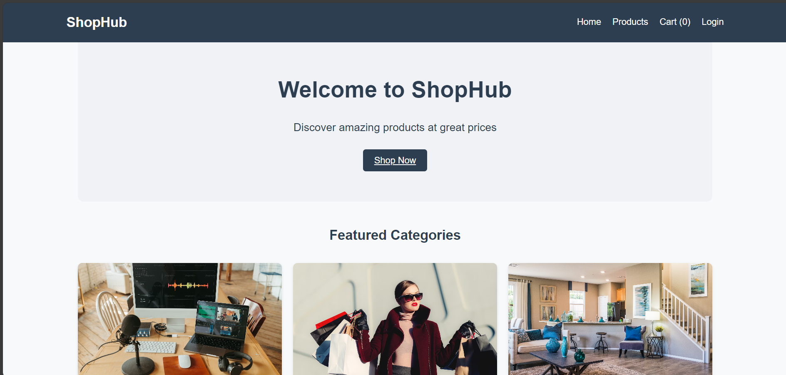

# 🎉 ShopHub - Modern Marketplace

## Live Demo

[](https://group16-ecommerce.onrender.com/)

### [](https://group16-ecommerce.onrender.com/)

**_A mordern marketplace built with MERN stack_**

## 🌟 Overview

ShopHub transforms the market with a modern, interactive interface designed for seamless shopping.

## ✨ Features

### Core Features

**Browse products**

- Browse all products

**Filter**

- Filter products by categories
- Filter products by price

**Product page**

- Browse to each product page
- can add to cart on that page

**Cart**

- Add item to cart.
- Update item in cart
- Remove product from cart.

### Core Features

## 🛠 Technology Stack

- Node.js
- Express.js
- MongoDB
- React

## Getting Started 🚀

### Prerequisites

- Node.js v14+ required
  `node --version`
- MongoDB server or Mongo cloud
- Git

### Installation Steps

1. Clone the repository:

   ```bash
   git clone https://github.com/SaddamTechie/Group16-ecommerce.git ecommerce
   cd ecommerce
   ```

2. Install dependencies:

   ```bash
   npm run build
   ```

3. Set up the database:

- Either setup local database or mongo cloud.

4. Configure environment variables:

   ```env
   MONGO_URI=<YOUR_MONGODB_CONNECTION_STRING>
   PORT=8000
   ```

   Create a `.env` file in the root directory and add the above configuration.

5. Start the server:

   ```bash
   npm run start
   ```

6. Access the application at `http://localhost:8000`

## API Endpoints 🛣️

- `GET /api/products` - Get all product
- `GET /api/products/:id` - Get product by id
- `POST /api/products` - Create new product
- `PUT /api/products/:id` - Update product by id
- `DELETE /api/products/:id` - Delete product by id

## 🌐 Deployment Guide

- Ensure you have setup your mongodb cloud.
- Push Your Code to GitHub:
  Make sure your code is in a GitHub repository.
- Connect Render(hosting service provider) to GitHub:
  In the Render dashboard, create a new web service.
- Connect it to your GitHub repository and select the branch you want to deploy.
- Configure Build Settings:
- Ensure the build command is set to 'npm run build' and that the start command 'npm run start' when setting up.
- Deploy:
  Click on the deploy button.
- Verify Deployment
  Once deployed, visit the URL provided by Render to ensure that your application is running and can connect to the mongodb cloud.

## 🖼 UI Screenshots


The products page displays all the products and can be filtered.

## 📈 Future Implementations and Improvements

- Admin dashboard to manage products
- User Authentication and Authorization

---

Made with ❤️ by Fullstack Group 16

---

© 2025 [ShopHub.](https://group16-ecommerce.onrender.com/) All rights reserved.
